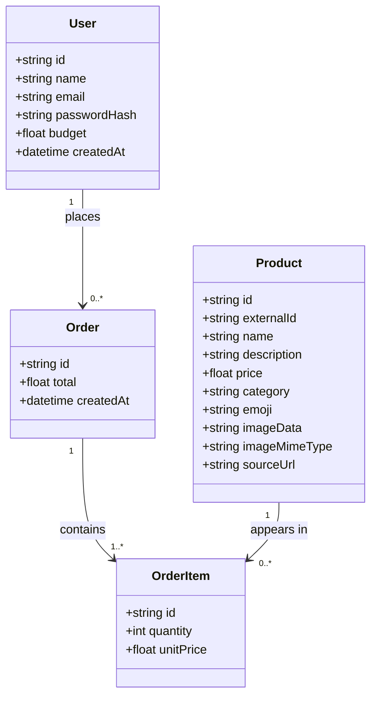

# Architecture

How the Furniture Buyer app is built. See [requirements.md](./requirements.md)
for what it needs to do.

## Overview

Furniture Buyer is a single Next.js application (App Router) that serves
both the UI and its own backend API routes — there's no separate
frontend/backend deployment to manage. Data lives in a single SQLite file,
accessed through Prisma.

```
Browser
  │  HTTP (pages + fetch calls)
  ▼
Next.js app (single process)
  ├─ Server Components (app/**/page.js)  ── read data directly via Prisma
  ├─ Client Components ("use client")     ── forms, cart state, fetch()
  └─ API routes (app/api/**/route.js)     ── auth, register, place order
        │
        ▼
   lib/prisma.js (Prisma Client singleton)
        │
        ▼
   prisma/dev.db (SQLite file)
```

## Tech stack

| Layer | Choice | Version | Why |
|---|---|---|---|
| Framework | Next.js (App Router, plain JS) | 16.2.12 | One project for UI + API; huge community docs |
| UI runtime | React | 19.2.8 | Ships with Next 16 |
| Styling | Tailwind CSS | 4.3.3 | CSS-first config (`@import "tailwindcss"` in `app/globals.css` + `@tailwindcss/postcss`) — no `tailwind.config.js` needed |
| Database | SQLite | — | Single file, zero setup, no separate server |
| ORM | Prisma | 6.19.3 (pinned) | Pinned below the 7.x line deliberately — Prisma 7 made driver adapters mandatory even for SQLite, adding a config file and adapter package with no benefit for a local single-file database |
| Auth | next-auth | 4.24.15 (pinned) | Pinned to the v4 line deliberately — confirmed via the npm registry that v4 is still the `latest`-tagged, genuinely stable release; the rewritten "Auth.js v5" most current tutorials show is still published only under the `beta` tag |
| Password hashing | bcryptjs | 3.0.3 | Pure JS, no native build step required |
| PDF text extraction | pdf-parse | 2.4.5 | One-off script use only (`scripts/extract-catalogue-pdf.mjs`), not a runtime dependency of the app itself |
| Embeddings | @xenova/transformers | 2.17.2 (`Xenova/all-MiniLM-L6-v2`) | Runs fully locally — no API key, no per-query cost, no vector DB needed at 762 products; chosen after the configured Azure OpenAI resource returned 404 for every embeddings deployment name tried |

## Data model

Four things the app needs to remember, derived directly from
[requirements.md](./requirements.md): who the buyer is (`User`), what's for
sale (`Product`), what a buyer bought in one checkout (`Order`), and the
individual line items inside that checkout (`OrderItem`).



**In plain English:**

- **User** is the buyer's account — name, email, a hashed password (never
  the real password), and `budget`, the total they're allowed to spend.
  This is the "Buyer" role from requirements.md; the code just calls it
  `User` since there's only one kind of account in this app.
- **Product** is one catalogue item — a name, description, price, category,
  and a real photo (`imageData`/`imageMimeType`) when the source catalog
  provides one, falling back to an `emoji` placeholder when it doesn't.
  `externalId` and `sourceUrl` trace a product back to where it came from.
  Products aren't tied to any one user; everyone browses the same catalogue.
- **Order** is a single checkout — "I'm buying these things right now." It
  belongs to one user and has a total and a timestamp, but it doesn't list
  products directly.
- **OrderItem** is why: an order is usually more than one product, in
  different quantities, so each product-within-an-order gets its own row —
  *this order, this product, this quantity, this price*. `unitPrice` is
  copied from the product's price at the moment of purchase and then never
  changes, so if the shop later changes a product's price, past orders
  still show what the buyer actually paid.

**How they connect:** one user can place many orders (or none yet); one
order is made up of one or more order items (an order can't be empty); one
product can show up in many order items, across many different orders and
different buyers — that's how the same $89 chair can be part of ten
different people's orders without ten copies of "chair" existing in the
database.

**Nothing stores "remaining budget" directly** — it's always calculated as
`budget − sum of that user's order totals`, computed fresh each time the
catalogue page loads. Storing it as its own field would risk it silently
drifting out of sync with the orders it's supposed to reflect.

Full field list: [prisma/schema.prisma](./prisma/schema.prisma).

## Product catalog source

Products are loaded from an external MongoDB collection (762 real IKEA
catalog items, seen live in `db.catalog`), not hand-written placeholders.
This is a one-off/rerunnable import, not a live connection the running app
depends on — once loaded, the app only ever talks to its own SQLite
database.

- **`MONGODB_URI`** (in `.env`, gitignored, never hardcoded) points at the
  source database. `.env.example` documents the shape without a real
  credential in it.
- **`scripts/import-catalog.mjs`** (`npm run import:catalog`) connects,
  reads every document, and replaces whatever's currently in the `Product`
  table. Because this is a full replace, it also clears `Order`/`OrderItem`
  rows first — they'd otherwise reference products about to disappear.
  User accounts are untouched.
- **Field mapping quirks worth knowing:** the source has no free-text
  description field, so one is synthesized from colour + dimensions (e.g.
  "black · W80 × H105 cm"). Its `image_url` field is misleadingly named —
  it's actually the raw JPEG bytes, base64-encoded, not a URL — so that's
  stored as `imageData`/`imageMimeType` rather than a link. `item_id` from
  the source becomes `externalId`, our idempotency key. `product_name` is
  **not** unique in the source (colour variants of the same item share a
  name), which is why `Product.name` isn't a unique field.
- **Images are never inlined into a page's HTML.** At ~63 KB average and
  762 products, embedding them directly would mean shipping tens of
  megabytes on every catalogue load. Instead, catalogue/order queries
  `select` only `imageMimeType` (to know a real photo exists) and the UI
  points an `` at `/api/products/[id]/image`
  (`app/api/products/[id]/image/route.js`), which streams the bytes for
  one product with a long-lived cache header. The browser then loads
  images lazily and in parallel instead of them bloating one response.
- **Known limitation:** the catalogue page renders all 762 products
  unpaginated (this preserves the simpler "one order across the whole
  catalogue" flow from before). It works, but pagination or search would be
  the natural next step if the list feels heavy — not built now to avoid
  a shopping-cart redesign that wasn't asked for.

## Home page: live hackathon API integration

Separate from the MongoDB-backed `/catalogue` above, the home page
(`app/page.js`) calls the hackathon's own **Product Search / Order / Balance
API** (from the Day 1 Participant Guide) live, on every request — this is a
real HTTP call at page-render time, not a one-off import into our database.

- **Endpoint used:** `GET /catalogue/search-index?limit=12` — explicitly the
  endpoint the guide says to use for browsing. The guide is emphatic that
  plain `GET /catalogue` (which embeds every product's image as base64) is
  the wrong choice here: against the real event catalogue it can take 20+
  seconds and has a much stricter rate limit. `search-index` returns the
  same fields minus images, fast.
- **No auth needed** for catalogue endpoints — confirmed in the guide
  ("The catalogue endpoints need no auth — they're public"), so this call
  sends no `X-Api-Key` header.
- **Env vars** (`.env`, gitignored): `HACKATHON_API_BASE_URL`,
  `HACKATHON_USER_ID`, `HACKATHON_API_KEY`. Only the base URL is used by
  this particular feature; the user ID and key are used by the balance
  integration below.
- **Caching:** `fetch(..., { next: { revalidate: 60 } })` — refreshes at
  most once a minute, so the home page doesn't hit the external API on
  every single visitor, but still shows real, near-live data.
- **Fails soft:** if the external API is slow, down, or errors, the fetch
  is wrapped in try/catch and returns `[]` — the "A few things in the
  catalogue" section just doesn't render rather than breaking the whole
  home page. The API being external and outside this app's control makes
  that degradation deliberate, not an oversight.

## Catalogue page: real balance, and real order placement

The catalogue page's balance figure comes from the hackathon API's `GET
/users/{id}` (`lib/hackathonApi.js`'s `getHackathonBalance()`), not from
the `User.budget` field or a locally-summed `Order` total. Clicking **Buy**
on a product calls the same API's real `POST /orders` — this genuinely
debits the event-tracked balance and creates a real order on the
hackathon's side, it is not a local simulation.

- **Why this is one balance, not per-buyer:** this app supports many local
  accounts (anyone can sign up), but the hackathon API recognizes exactly
  one account — `HACKATHON_USER_ID`, authenticated by `HACKATHON_API_KEY`.
  It has no idea our app's `User` table exists. Every buyer logged into
  this app sees and spends against the *same* real balance — the hackathon
  participant's, not "this buyer's." That's a direct consequence of there
  being one hackathon account and many local ones, not a bug.
- **One item per click, not a multi-item cart.** The UI is a quantity input
  + Buy button per product card, matching how `POST /orders` is actually
  used here (one `item_id` per request). The real endpoint's schema
  (`OrderRequest`, confirmed against the API's own `/openapi.json`) does
  technically accept multiple `items` in one call — this app just doesn't
  build a multi-item cart around that, to keep "click Buy on a product"
  literal and the blast radius of one click obvious.
- **The Participant Guide's example request body is wrong for the actual
  deployed API.** The guide shows `{"user_id": ..., "item_id": ...,
  "quantity": ...}`; the real schema (per `/openapi.json`) is `{"user_id":
  ..., "items": [{"item_id": ..., "quantity": ...}]}`. This was caught by
  testing a harmless malformed/bogus-item-id request *before* writing code
  against the guide's example verbatim — worth remembering if the guide
  gets used for anything else. Error bodies are FastAPI's own
  `{"detail": "message"}` (or, for request-validation failures, `{"detail":
  [...]}` — an array of Pydantic error objects), not `{"error": ...}`;
  `extractDetail()` in `lib/hackathonApi.js` handles both shapes.
- **`Idempotency-Key` header** (a fresh `crypto.randomUUID()` per click) is
  sent on every `POST /orders` call. The API docs its own semantics as
  "resending the same order with the same key returns the original result
  instead of charging again" — this makes a double-click or a retried
  request after a dropped connection safe rather than a duplicate charge.
- **Order history is still local.** A successful real order also creates an
  `Order` + one `OrderItem` row here (`Order.externalOrderId` stores the
  real `order_id` for traceability), so "My Orders" keeps working
  unchanged. `product.externalId` (the same field the MongoDB import
  populated) is what's sent as `item_id` — this only works for products
  that have one, which is all of them post-import, but is checked
  defensively anyway.
- **Always fetched fresh** (`cache: "no-store"`) — a stale balance here
  would be a correctness bug (ordering against a number that's no longer
  true), not just staleness.
- **Fails closed, not soft:** if the initial balance fetch fails, the
  catalogue page shows "Real balance unavailable" and disables every Buy
  button; if `POST /orders` itself fails, the specific product's card shows
  a clear error inline, and no local `Order` row is created. Guessing at
  spending power, or silently recording an order that wasn't actually
  placed, would both be worse than an honest error here.
- **Specific, friendly messages for the two failure modes buyers actually
  hit**, rather than the API's raw `{"detail": ...}` text (which the API
  itself logs server-side via `console.error` for debugging, but never
  shows to the user):
  - **Insufficient balance (`402`)** — `app/api/orders/route.js` fetches
    the current balance again and shows the real numbers: "You don't have
    enough balance for this order — it costs $X, but only $Y is
    available."
  - **Product no longer available (`404`, or the local `productId` doesn't
    even resolve to a `Product` anymore)** — both collapse to the same
    "This item is no longer available." Whether the gap is on our side (a
    stale client holding a deleted product) or theirs (the real catalogue
    item is gone) isn't something a buyer needs to distinguish.
  - Every other failure (auth/config issues, rate limiting, network errors,
    an unexpected exception anywhere in the handler) is caught and turned
    into a clean JSON error response — `POST /api/orders`'s whole handler
    body is wrapped in try/catch specifically so nothing here can surface
    as a raw 500 or an unhandled exception. The client mirrors this: the
    fetch/parse in `handleBuy()` is also wrapped, so a dropped connection
    or a non-JSON response sets a normal per-card error state instead of
    leaving the button stuck on "Buying..." or throwing uncaught.
- **`User.budget`** (the field collected at sign-up) remains unused for
  enforcement — a known loose end, left as-is to keep this change scoped to
  what was asked.
- **Not built:** fetching/displaying the real PDF invoice (`GET
  /orders/{order_id}/invoice`) that the hackathon API generates per order.
  The inline confirmation (order id, amount, new balance) covers what was
  asked; the invoice endpoint is there if a receipt view is wanted later —
  `Order.externalOrderId` already has what it'd need.

## Shopping assistant agent: RAG over the PDF catalogue

`/assistant` is a plain-English chat interface backed by GPT-5 mini (Azure
OpenAI — `lib/azureOpenAI.js`). Catalogue search used to be two tools the
model called (`search_catalogue`, `get_product_detail`); it's now classic
retrieve-then-generate RAG instead — the server retrieves candidate
products by embedding similarity *before* calling the model at all, and
hands them to it as plain context. Only `check_balance` and `place_order`
remain as tools (schemas in `lib/agentTools.js`), since those are actions,
not lookups.

**Why RAG instead of tool-calling for search:** the live search
API/database is still there for the catalogue page, but the assistant's
retrieval is now built from a completely different source — a 762-product,
64-page print-catalogue PDF the source data was also provided as. The
pipeline, in order:

1. **`scripts/extract-catalogue-pdf.mjs`** parses `data/source/Full-Product-Catalogue.pdf`
   (gitignored — large binary input) into `data/catalogue-parsed.json`, 762
   structured records: `{itemId, name, category, price, dimensions}`. The
   PDF's raw text (via `pdf-parse` v2's `PDFParse`/`getText()` API — a
   different shape from v1's plain function call) comes out as a flat
   sequence per product (name, category, price, optional dimensions,
   item_id); the 17 known category strings (from the live API's
   `/catalogue/categories`) anchor where one product ends and the next
   begins. Cross-validated against the existing Prisma `Product` table
   after parsing: 762/762 found, 0 price mismatches, 0 category
   mismatches, 1 benign name truncation traced to the source PDF itself.
2. **`scripts/build-embeddings.mjs`** chunks **per product** (the
   catalogue's natural unit — not a fixed character count) into one
   sentence per product (name, category, price, dimensions), embeds each
   with a local model, and writes `data/catalogue-embeddings.json` — 762
   records, each the original structured fields *plus* `text` and a
   384-dim `embedding` array. Keeping the structured fields alongside the
   embedding (not just the chunk text) is what lets `lib/rag.js` hand the
   model real fields to reason over, rather than a blob of prose it'd have
   to re-parse.
3. **Embedding model: local, not Azure.** `text-embedding-3-small/-large`
   and `ada-002` were all tested directly against the configured Azure
   OpenAI resource first — all returned `404 DeploymentNotFound` — so
   embeddings use `@xenova/transformers`'s `Xenova/all-MiniLM-L6-v2`
   (384-dim, runs fully locally, no API key, no per-query cost). This also
   fits the "no vector database needed" framing directly: at 762 products,
   the whole embedding set is a few MB, comfortably held in memory.
4. **`lib/rag.js`'s `retrieveProducts(query, topK)`** loads
   `catalogue-embeddings.json` once (module-level cache) and does a plain
   linear scan: embed the query with the same model, cosine-similarity
   against all 762 vectors (a dot product alone, since every vector is
   L2-normalized at embed time), sort, return the top K with their full
   structured fields. No index, no vector DB — an unnecessary complexity
   at this scale.
5. **Retrieval was verified standalone before wiring up generation** — a
   throwaway script ran 5 representative queries ("cheap bar stools",
   "something white for a kid's bedroom", "a sturdy office chair",
   "outdoor dining table", "storage for a small bathroom") and printed the
   top-8 results by eye. All 5 returned topically correct results (e.g.
   bar stools/tables scoring ~0.67–0.71 for the bar-stool query; Office
   chairs topping the office-chair query) before any model call was
   involved.

**How retrieval feeds generation** — `app/api/agent/chat/route.js`:
before each model call, it retrieves the top 15 products for the *current
turn's context* and injects them as a `CATALOGUE CANDIDATES` system
message (name, category, price, dimensions, item_id per candidate). The
system prompt tells the model to only reference products from that list,
and spells out what retrieval can't do:

- **It's topical similarity, not an exact filter.** For "cheap bar stools"
  (price *within* a topic), the model scans the price field across
  candidates itself and says so plainly — verified live, and it does
  exactly that, then returns a correctly price-sorted list.
- **"The cheapest thing you have" (no topic at all) is a different
  problem, and embeddings genuinely can't solve it.** Semantic search only
  returns items that *resemble the query text* — the actual cheapest
  product in the catalogue (found during smoke-testing to be a $1.20
  furniture knob) has no reason to resemble the phrase "cheapest item," so
  it was never in the top-15 candidates at all. The model would (and did,
  before this was caught) confidently report "the cheapest item" while
  only having seen 15 topically-arbitrary products — an answer that's
  wrong in a way that looks right. Fixed with a second, non-semantic path:
  `lib/rag.js`'s `getPriceExtremes()` sorts the full in-memory 762-record
  list directly by price (no embedding call at all) and returns the true
  N cheapest/priciest. `app/api/agent/chat/route.js` detects
  price-superlative language in the message (`cheapest`, `most expensive`,
  `most affordable`, etc.) and injects this as a separate `GLOBAL PRICE
  EXTREMES` context block alongside the normal candidates, with the system
  prompt telling the model to prefer it for whole-catalogue questions.
  Verified live: "please find the cheapest item" now correctly returns the
  $1.20 knob (matching a direct sort of the data file), while "cheapest
  bar stool" still correctly reasons over just the bar-stool candidates
  rather than jumping to the unrelated global minimum.
- **There is no colour data at all in this source.** Unlike the live
  API/MongoDB catalogue (which has a `colours` field), the PDF simply
  doesn't print colour per product — so this is a genuine capability gap
  versus the old tool-based version, not a prompting choice. The model is
  told to say "I don't have that information" rather than guess, and does.
- **The retrieval query is the recent conversation, not just the latest
  message.** A short confirmation reply like "yes, place the order" carries
  no furniture content on its own — retrieving on it alone returned
  unrelated candidates and dropped the item the user had just agreed to,
  breaking the purchase flow (caught live during testing: the model
  correctly refused to place an order for an item_id no longer in its
  candidate list, but that meant the *whole plan fell through* on a plain
  "yes"). Fixed by building the retrieval query from the last few history
  turns plus the new message, so a confirmation stays anchored to whatever
  the last couple of turns were actually about.
- **The model does its own reasoning over retrieved results — this is
  the point of the exercise, not a limitation.**
- **Real purchases are gated architecturally, not just by prompting.**
  The system prompt tells the model to confirm with the user in
  conversation before calling `place_order` — and in practice it reliably
  does (it asked in plain text, then asked again for an explicit "yes"
  even when told "yes" in the same message as the buy request). But the
  route handler does **not** rely on that alone: any `place_order` tool
  call is intercepted before anything executes. The model's chosen
  `item_id`/`quantity` are resolved to a local `Product` (via
  `externalId`) and returned to the client as a `pendingPurchase` — no
  purchase happens until the human clicks **Confirm**, which calls the
  *same, already-tested* `POST /api/orders` used by the catalogue's Buy
  button. This means the agent never talks to the real order-placing
  endpoint directly; only a human click does, through code that already
  had its own error-handling and safety review.
- **Product images never reach the model.** The PDF-derived candidates only
  ever carry text fields (name, category, price, dimensions, item_id) —
  there was never an image to strip in the first place, unlike the old
  `get_product_detail` tool result.
- **Conversation history is kept lean on purpose.** Only the user-visible
  text turns (user asks, assistant replies) persist across separate chat
  messages, sent up fresh by the client each time — this is also what the
  retrieval query is built from (see above), so it doubles as the source
  of retrieval context, not just display history.
- **Defensive basics matching the rest of the app:** the whole route
  handler is wrapped in try/catch, client-supplied `history` is sanitized
  (only `user`/`assistant` roles, capped length) before being spliced into
  the prompt, and an `Idempotency-Key` is still sent on the real
  `POST /orders` call (inherited from `placeHackathonOrder()`), so a
  double-click on Confirm can't double-charge.
- **A failed purchase attempt is explained by the model, not surfaced as a
  raw error.** The actual order-placement logic (product lookup, calling
  `placeHackathonOrder`, the friendly 402/404 messages) was pulled out of
  `app/api/orders/route.js` into `lib/orderService.js`'s
  `attemptPurchase()`, shared by both the catalogue's Buy button and the
  assistant's Confirm click — one real order-placement path either way. On
  **success**, the assistant's confirm route (`app/api/agent/confirm-purchase/route.js`)
  replies with a plain, pre-formatted confirmation directly — no extra
  model call needed for that. On **failure** (insufficient balance, item
  no longer available, or anything else `attemptPurchase` returns), the
  already-friendly error string is handed to the model — along with the
  conversation history for context — with instructions to explain it
  plainly and suggest one concrete alternative, rather than the raw
  message being dropped into the chat as-is. Verified live: asking to buy
  100,000 bar tables got rejected with a message explaining the real
  $4,769.60 balance and proposing "you can afford up to 11 tables" as a
  concrete next step; a request for an item with no matching local product
  got "that item sold or was removed — want me to search for something
  similar?" Both confirmed to leave the real balance untouched. This model
  call for the failure path doesn't include `TOOL_SCHEMAS` — it only needs
  to produce text, not call more tools, and skipping tools here also rules
  out it trying to call `place_order` again mid-explanation.

## Authentication

- **Strategy:** NextAuth's Credentials provider with **JWT sessions** — no
  NextAuth database adapter, so no `Account`/`Session`/`VerificationToken`
  tables. That's the simplest option for a plain email/password login.
- **Sign-up** (`POST /api/register`) is hand-rolled: it hashes the password
  with bcrypt and creates a `User` row. NextAuth's Credentials provider only
  handles *logging in*, not account creation.
- **Login** happens through NextAuth's `authorize()` callback in
  `lib/auth.js`: look up the user by email, `bcrypt.compare()` the
  password, return the user if it matches.
- **Route protection:** no `middleware.js`/`proxy.js` file. Next.js 16
  renamed that file convention (`middleware` → `proxy`), and layering an
  older, deliberately-stable auth library on top of a brand-new
  framework-level rename was an avoidable risk. Instead, each protected page
  (`app/catalogue/page.js`, `app/orders/page.js`) is a server component that
  calls `getServerSession()` itself and redirects to `/login` if there's no
  session.

## Request flows

**Sign up** — `register/page.js` (client) → `POST /api/register` (hashes
password, creates `User`) → on success, immediately calls NextAuth's
`signIn("credentials", …)` → redirected to `/catalogue`.

**Browsing + ordering** — `catalogue/page.js` (server component) reads the
session, then queries `Product.findMany`, the user's `budget`, and an
`Order.aggregate` sum in parallel, and hands that data to
`CatalogueClient.js` (client component), which owns the cart/quantity state
and calls `POST /api/orders` when the user submits.

**Order validation** — `app/api/orders/route.js` re-checks the session
server-side, re-fetches current product prices from the database (it never
trusts prices sent from the browser), computes the order total, re-computes
remaining budget from the database, and only creates the `Order` +
`OrderItem` rows if the total fits. This is what makes budget enforcement
tamper-proof — a user can't place an over-budget order by editing the page
or calling the API directly with a fake total.

## Folder structure

```
prisma/
  schema.prisma        data model
  seed.js               demo login only (no products — see scripts/)
scripts/
  import-catalog.mjs           loads the real catalog from MongoDB, replacing Product rows
  extract-catalogue-pdf.mjs     parses data/source/*.pdf into data/catalogue-parsed.json
  build-embeddings.mjs           embeds data/catalogue-parsed.json into data/catalogue-embeddings.json
data/
  source/                gitignored — the input PDF
  catalogue-parsed.json         762 structured products (committed)
  catalogue-embeddings.json     the same, plus embeddings (committed)
app/
  layout.js             root layout, nav bar, session provider
  page.js               home page
  login/, register/      auth forms
  catalogue/             browse + place an order
  orders/page.js          order history
  assistant/              plain-English shopping assistant chat UI
  api/
    auth/[...nextauth]/route.js
    register/route.js
    orders/route.js                    the catalogue's Buy button
    products/[id]/image/route.js       streams one product's photo
    agent/
      chat/route.js                     the assistant's tool-calling loop
      confirm-purchase/route.js          attempts the purchase, explains failures via the model
components/             Navbar, SessionProvider wrapper
lib/
  prisma.js             Prisma client singleton
  auth.js               NextAuth config
  hackathonApi.js        hackathon API client (balance, order, search, detail)
  orderService.js         shared attemptPurchase() — the one real order-placement path
  agentTools.js           tool schemas (check_balance, place_order) + dispatch
  azureOpenAI.js          Azure OpenAI chat-completions client
  rag.js                  in-memory embedding retrieval (retrieveProducts())
```

## Local development

```bash
npm install
npm run db:migrate      # create/update the SQLite database from schema.prisma
npm run db:seed         # create a demo account
npm run import:catalog  # load the real catalog (needs MONGODB_URI in .env)
npm run dev              # http://localhost:3000
```

The assistant's RAG data (`data/catalogue-parsed.json`,
`data/catalogue-embeddings.json`) is already committed, so a fresh clone
doesn't need to regenerate it. To rebuild from scratch (e.g. after a
catalogue change), with the source PDF at `data/source/Full-Product-Catalogue.pdf`:

```bash
node scripts/extract-catalogue-pdf.mjs   # -> data/catalogue-parsed.json
node scripts/build-embeddings.mjs        # -> data/catalogue-embeddings.json (downloads the ~90MB model on first run)
```
