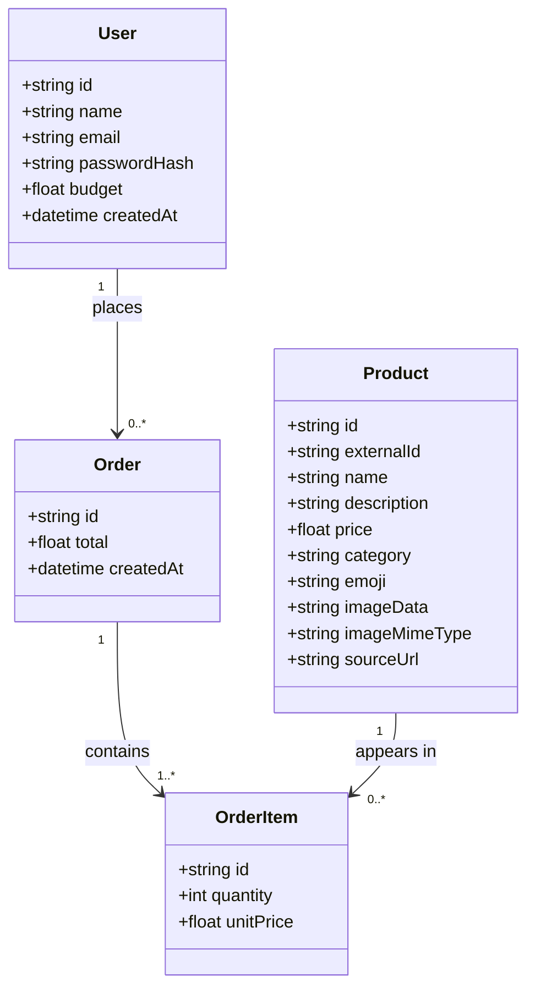

# Architecture

How the Furniture Buyer app is built. See [requirements.md](./requirements.md)
for what it needs to do.

## Overview

Furniture Buyer is a single Next.js application (App Router) that serves
both the UI and its own backend API routes — there's no separate
frontend/backend deployment to manage. Data lives in a single SQLite file,
accessed through Prisma.

```
Browser
  │  HTTP (pages + fetch calls)
  ▼
Next.js app (single process)
  ├─ Server Components (app/**/page.js)  ── read data directly via Prisma
  ├─ Client Components ("use client")     ── forms, cart state, fetch()
  └─ API routes (app/api/**/route.js)     ── auth, register, place order
        │
        ▼
   lib/prisma.js (Prisma Client singleton)
        │
        ▼
   prisma/dev.db (SQLite file)
```

## Tech stack

| Layer | Choice | Version | Why |
|---|---|---|---|
| Framework | Next.js (App Router, plain JS) | 16.2.12 | One project for UI + API; huge community docs |
| UI runtime | React | 19.2.8 | Ships with Next 16 |
| Styling | Tailwind CSS | 4.3.3 | CSS-first config (`@import "tailwindcss"` in `app/globals.css` + `@tailwindcss/postcss`) — no `tailwind.config.js` needed |
| Database | SQLite | — | Single file, zero setup, no separate server |
| ORM | Prisma | 6.19.3 (pinned) | Pinned below the 7.x line deliberately — Prisma 7 made driver adapters mandatory even for SQLite, adding a config file and adapter package with no benefit for a local single-file database |
| Auth | next-auth | 4.24.15 (pinned) | Pinned to the v4 line deliberately — confirmed via the npm registry that v4 is still the `latest`-tagged, genuinely stable release; the rewritten "Auth.js v5" most current tutorials show is still published only under the `beta` tag |
| Password hashing | bcryptjs | 3.0.3 | Pure JS, no native build step required |

## Data model

Four things the app needs to remember, derived directly from
[requirements.md](./requirements.md): who the buyer is (`User`), what's for
sale (`Product`), what a buyer bought in one checkout (`Order`), and the
individual line items inside that checkout (`OrderItem`).



**In plain English:**

- **User** is the buyer's account — name, email, a hashed password (never
  the real password), and `budget`, the total they're allowed to spend.
  This is the "Buyer" role from requirements.md; the code just calls it
  `User` since there's only one kind of account in this app.
- **Product** is one catalogue item — a name, description, price, category,
  and a real photo (`imageData`/`imageMimeType`) when the source catalog
  provides one, falling back to an `emoji` placeholder when it doesn't.
  `externalId` and `sourceUrl` trace a product back to where it came from.
  Products aren't tied to any one user; everyone browses the same catalogue.
- **Order** is a single checkout — "I'm buying these things right now." It
  belongs to one user and has a total and a timestamp, but it doesn't list
  products directly.
- **OrderItem** is why: an order is usually more than one product, in
  different quantities, so each product-within-an-order gets its own row —
  *this order, this product, this quantity, this price*. `unitPrice` is
  copied from the product's price at the moment of purchase and then never
  changes, so if the shop later changes a product's price, past orders
  still show what the buyer actually paid.

**How they connect:** one user can place many orders (or none yet); one
order is made up of one or more order items (an order can't be empty); one
product can show up in many order items, across many different orders and
different buyers — that's how the same $89 chair can be part of ten
different people's orders without ten copies of "chair" existing in the
database.

**Nothing stores "remaining budget" directly** — it's always calculated as
`budget − sum of that user's order totals`, computed fresh each time the
catalogue page loads. Storing it as its own field would risk it silently
drifting out of sync with the orders it's supposed to reflect.

Full field list: [prisma/schema.prisma](./prisma/schema.prisma).

## Product catalog source

Products are loaded from an external MongoDB collection (762 real IKEA
catalog items, seen live in `db.catalog`), not hand-written placeholders.
This is a one-off/rerunnable import, not a live connection the running app
depends on — once loaded, the app only ever talks to its own SQLite
database.

- **`MONGODB_URI`** (in `.env`, gitignored, never hardcoded) points at the
  source database. `.env.example` documents the shape without a real
  credential in it.
- **`scripts/import-catalog.mjs`** (`npm run import:catalog`) connects,
  reads every document, and replaces whatever's currently in the `Product`
  table. Because this is a full replace, it also clears `Order`/`OrderItem`
  rows first — they'd otherwise reference products about to disappear.
  User accounts are untouched.
- **Field mapping quirks worth knowing:** the source has no free-text
  description field, so one is synthesized from colour + dimensions (e.g.
  "black · W80 × H105 cm"). Its `image_url` field is misleadingly named —
  it's actually the raw JPEG bytes, base64-encoded, not a URL — so that's
  stored as `imageData`/`imageMimeType` rather than a link. `item_id` from
  the source becomes `externalId`, our idempotency key. `product_name` is
  **not** unique in the source (colour variants of the same item share a
  name), which is why `Product.name` isn't a unique field.
- **Images are never inlined into a page's HTML.** At ~63 KB average and
  762 products, embedding them directly would mean shipping tens of
  megabytes on every catalogue load. Instead, catalogue/order queries
  `select` only `imageMimeType` (to know a real photo exists) and the UI
  points an `` at `/api/products/[id]/image`
  (`app/api/products/[id]/image/route.js`), which streams the bytes for
  one product with a long-lived cache header. The browser then loads
  images lazily and in parallel instead of them bloating one response.
- **Known limitation:** the catalogue page renders all 762 products
  unpaginated (this preserves the simpler "one order across the whole
  catalogue" flow from before). It works, but pagination or search would be
  the natural next step if the list feels heavy — not built now to avoid
  a shopping-cart redesign that wasn't asked for.

## Home page: live hackathon API integration

Separate from the MongoDB-backed `/catalogue` above, the home page
(`app/page.js`) calls the hackathon's own **Product Search / Order / Balance
API** (from the Day 1 Participant Guide) live, on every request — this is a
real HTTP call at page-render time, not a one-off import into our database.

- **Endpoint used:** `GET /catalogue/search-index?limit=12` — explicitly the
  endpoint the guide says to use for browsing. The guide is emphatic that
  plain `GET /catalogue` (which embeds every product's image as base64) is
  the wrong choice here: against the real event catalogue it can take 20+
  seconds and has a much stricter rate limit. `search-index` returns the
  same fields minus images, fast.
- **No auth needed** for catalogue endpoints — confirmed in the guide
  ("The catalogue endpoints need no auth — they're public"), so this call
  sends no `X-Api-Key` header.
- **Env vars** (`.env`, gitignored): `HACKATHON_API_BASE_URL`,
  `HACKATHON_USER_ID`, `HACKATHON_API_KEY`. Only the base URL is used by
  this particular feature; the user ID and key are used by the balance
  integration below.
- **Caching:** `fetch(..., { next: { revalidate: 60 } })` — refreshes at
  most once a minute, so the home page doesn't hit the external API on
  every single visitor, but still shows real, near-live data.
- **Fails soft:** if the external API is slow, down, or errors, the fetch
  is wrapped in try/catch and returns `[]` — the "A few things in the
  catalogue" section just doesn't render rather than breaking the whole
  home page. The API being external and outside this app's control makes
  that degradation deliberate, not an oversight.

## Catalogue page: real balance, and real order placement

The catalogue page's balance figure comes from the hackathon API's `GET
/users/{id}` (`lib/hackathonApi.js`'s `getHackathonBalance()`), not from
the `User.budget` field or a locally-summed `Order` total. Clicking **Buy**
on a product calls the same API's real `POST /orders` — this genuinely
debits the event-tracked balance and creates a real order on the
hackathon's side, it is not a local simulation.

- **Why this is one balance, not per-buyer:** this app supports many local
  accounts (anyone can sign up), but the hackathon API recognizes exactly
  one account — `HACKATHON_USER_ID`, authenticated by `HACKATHON_API_KEY`.
  It has no idea our app's `User` table exists. Every buyer logged into
  this app sees and spends against the *same* real balance — the hackathon
  participant's, not "this buyer's." That's a direct consequence of there
  being one hackathon account and many local ones, not a bug.
- **One item per click, not a multi-item cart.** The UI is a quantity input
  + Buy button per product card, matching how `POST /orders` is actually
  used here (one `item_id` per request). The real endpoint's schema
  (`OrderRequest`, confirmed against the API's own `/openapi.json`) does
  technically accept multiple `items` in one call — this app just doesn't
  build a multi-item cart around that, to keep "click Buy on a product"
  literal and the blast radius of one click obvious.
- **The Participant Guide's example request body is wrong for the actual
  deployed API.** The guide shows `{"user_id": ..., "item_id": ...,
  "quantity": ...}`; the real schema (per `/openapi.json`) is `{"user_id":
  ..., "items": [{"item_id": ..., "quantity": ...}]}`. This was caught by
  testing a harmless malformed/bogus-item-id request *before* writing code
  against the guide's example verbatim — worth remembering if the guide
  gets used for anything else. Error bodies are FastAPI's own
  `{"detail": "message"}` (or, for request-validation failures, `{"detail":
  [...]}` — an array of Pydantic error objects), not `{"error": ...}`;
  `extractDetail()` in `lib/hackathonApi.js` handles both shapes.
- **`Idempotency-Key` header** (a fresh `crypto.randomUUID()` per click) is
  sent on every `POST /orders` call. The API docs its own semantics as
  "resending the same order with the same key returns the original result
  instead of charging again" — this makes a double-click or a retried
  request after a dropped connection safe rather than a duplicate charge.
- **Order history is still local.** A successful real order also creates an
  `Order` + one `OrderItem` row here (`Order.externalOrderId` stores the
  real `order_id` for traceability), so "My Orders" keeps working
  unchanged. `product.externalId` (the same field the MongoDB import
  populated) is what's sent as `item_id` — this only works for products
  that have one, which is all of them post-import, but is checked
  defensively anyway.
- **Always fetched fresh** (`cache: "no-store"`) — a stale balance here
  would be a correctness bug (ordering against a number that's no longer
  true), not just staleness.
- **Fails closed, not soft:** if the initial balance fetch fails, the
  catalogue page shows "Real balance unavailable" and disables every Buy
  button; if `POST /orders` itself fails, the specific product's card shows
  a clear error inline, and no local `Order` row is created. Guessing at
  spending power, or silently recording an order that wasn't actually
  placed, would both be worse than an honest error here.
- **Specific, friendly messages for the two failure modes buyers actually
  hit**, rather than the API's raw `{"detail": ...}` text (which the API
  itself logs server-side via `console.error` for debugging, but never
  shows to the user):
  - **Insufficient balance (`402`)** — `app/api/orders/route.js` fetches
    the current balance again and shows the real numbers: "You don't have
    enough balance for this order — it costs $X, but only $Y is
    available."
  - **Product no longer available (`404`, or the local `productId` doesn't
    even resolve to a `Product` anymore)** — both collapse to the same
    "This item is no longer available." Whether the gap is on our side (a
    stale client holding a deleted product) or theirs (the real catalogue
    item is gone) isn't something a buyer needs to distinguish.
  - Every other failure (auth/config issues, rate limiting, network errors,
    an unexpected exception anywhere in the handler) is caught and turned
    into a clean JSON error response — `POST /api/orders`'s whole handler
    body is wrapped in try/catch specifically so nothing here can surface
    as a raw 500 or an unhandled exception. The client mirrors this: the
    fetch/parse in `handleBuy()` is also wrapped, so a dropped connection
    or a non-JSON response sets a normal per-card error state instead of
    leaving the button stuck on "Buying..." or throwing uncaught.
- **`User.budget`** (the field collected at sign-up) remains unused for
  enforcement — a known loose end, left as-is to keep this change scoped to
  what was asked.
- **Not built:** fetching/displaying the real PDF invoice (`GET
  /orders/{order_id}/invoice`) that the hackathon API generates per order.
  The inline confirmation (order id, amount, new balance) covers what was
  asked; the invoice endpoint is there if a receipt view is wanted later —
  `Order.externalOrderId` already has what it'd need.

## Authentication

- **Strategy:** NextAuth's Credentials provider with **JWT sessions** — no
  NextAuth database adapter, so no `Account`/`Session`/`VerificationToken`
  tables. That's the simplest option for a plain email/password login.
- **Sign-up** (`POST /api/register`) is hand-rolled: it hashes the password
  with bcrypt and creates a `User` row. NextAuth's Credentials provider only
  handles *logging in*, not account creation.
- **Login** happens through NextAuth's `authorize()` callback in
  `lib/auth.js`: look up the user by email, `bcrypt.compare()` the
  password, return the user if it matches.
- **Route protection:** no `middleware.js`/`proxy.js` file. Next.js 16
  renamed that file convention (`middleware` → `proxy`), and layering an
  older, deliberately-stable auth library on top of a brand-new
  framework-level rename was an avoidable risk. Instead, each protected page
  (`app/catalogue/page.js`, `app/orders/page.js`) is a server component that
  calls `getServerSession()` itself and redirects to `/login` if there's no
  session.

## Request flows

**Sign up** — `register/page.js` (client) → `POST /api/register` (hashes
password, creates `User`) → on success, immediately calls NextAuth's
`signIn("credentials", …)` → redirected to `/catalogue`.

**Browsing + ordering** — `catalogue/page.js` (server component) reads the
session, then queries `Product.findMany`, the user's `budget`, and an
`Order.aggregate` sum in parallel, and hands that data to
`CatalogueClient.js` (client component), which owns the cart/quantity state
and calls `POST /api/orders` when the user submits.

**Order validation** — `app/api/orders/route.js` re-checks the session
server-side, re-fetches current product prices from the database (it never
trusts prices sent from the browser), computes the order total, re-computes
remaining budget from the database, and only creates the `Order` +
`OrderItem` rows if the total fits. This is what makes budget enforcement
tamper-proof — a user can't place an over-budget order by editing the page
or calling the API directly with a fake total.

## Folder structure

```
prisma/
  schema.prisma        data model
  seed.js               demo login only (no products — see scripts/)
scripts/
  import-catalog.mjs    loads the real catalog from MongoDB, replacing Product rows
app/
  layout.js             root layout, nav bar, session provider
  page.js               home page
  login/, register/      auth forms
  catalogue/             browse + place an order
  orders/page.js          order history
  api/
    auth/[...nextauth]/route.js
    register/route.js
    orders/route.js
    products/[id]/image/route.js   streams one product's photo
components/             Navbar, SessionProvider wrapper
lib/
  prisma.js             Prisma client singleton
  auth.js               NextAuth config
```

## Local development

```bash
npm install
npm run db:migrate      # create/update the SQLite database from schema.prisma
npm run db:seed         # create a demo account
npm run import:catalog  # load the real catalog (needs MONGODB_URI in .env)
npm run dev              # http://localhost:3000
```
